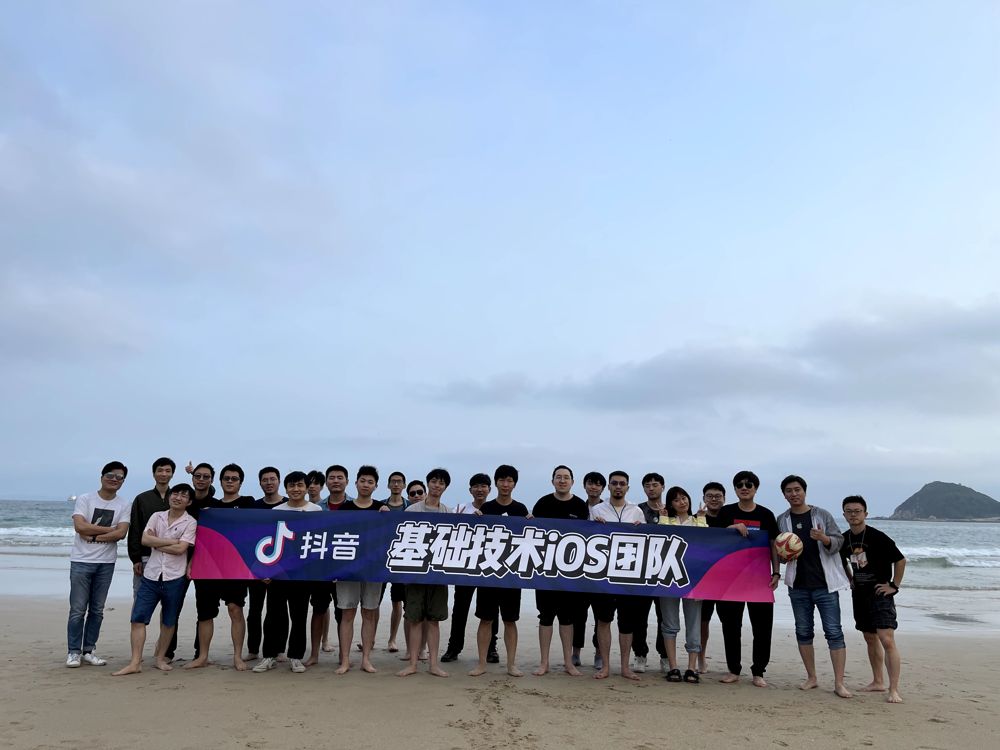

# Bytedance Experience Report
## Background

Company: ByteDance Ltd. (China)

Department / Team: TikTok iOS Infrastructure Team

Position: iOS Software Developer

Employment Period: June 2021 – July 2024

Work Mode: Full-time

## Main Responsibilities and Results

Guaranteed the quality of TikTok’s iOS core UI component DanceUI. 

* Established and maintained a comprehensive automated testing framework, improving reliability and developer efficiency.

Control the release of DanceUI. 

* Developed and managed an automated release management system, streamlining deployment and version control.

Deeply contributed to the development of DanceUI.

* Reverse-engineered the SwiftUI Text component and contributed to the internal DanceUI library.

Accelerated package integration processes. 

* Significantly reducing `pod install` time, improving build efficiency for developers.

👉 See *Detailed Projects* for full technical coverage.

## Reflection & Learning

Aligning responsibility with authority is a key principle in resolving team conflicts. As the person responsible for code quality, I realized that the testing and validation tools I built must also have the authority to block unqualified code. Ensuring the stability and reliability of these tools became my first priority—both as a safeguard against misuse of authority and as the foundation for earning the trust of the team.

Delivering tasks on time is the lifeline of a developer. To achieve this, it is essential to break down requirements into manageable units, set clear priorities, and maintain continuous communication with the team throughout the development cycle. Identifying risks early and addressing potential blockers are key to ensuring timely delivery. At the same time, balancing speed with code quality helps sustain long-term productivity and trust within the team.

## Detailed Projects

### CI

key words: **bash, yaml, API**

### Test Type and Case

